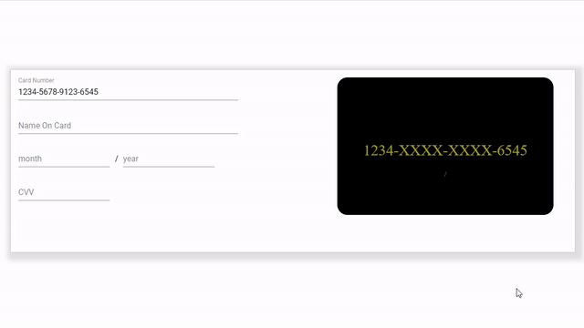

# Interactive Pay Card (Angular 8)
## Introduction
This is recent famous interactive pay card or credit/debit card form design,which is currently in vue and react,
#####  A fantastic credit card form with smooth and sweet micro-interactions.
https://github.com/muhammederdem/vue-interactive-paycard
https://github.com/jasminmif/react-interactive-paycard
and now in  `Angular 8` 
### Demo 

## Also
This is also example of usage of ReactiveFormsModule in Angular 8
## Setup
To run this project, install it locally using npm:
### Install
Run `npm install` for installing npm packages from `package.json` 
### Development server
Run `ng serve` for a dev server. Navigate to `http://localhost:4200/`. The app will automatically reload if you change any of the source files.

### Ping Me:
https://www.linkedin.com/in/machirajusaisandeep/
https://www.instagram.com/sandeep_machiraju/
